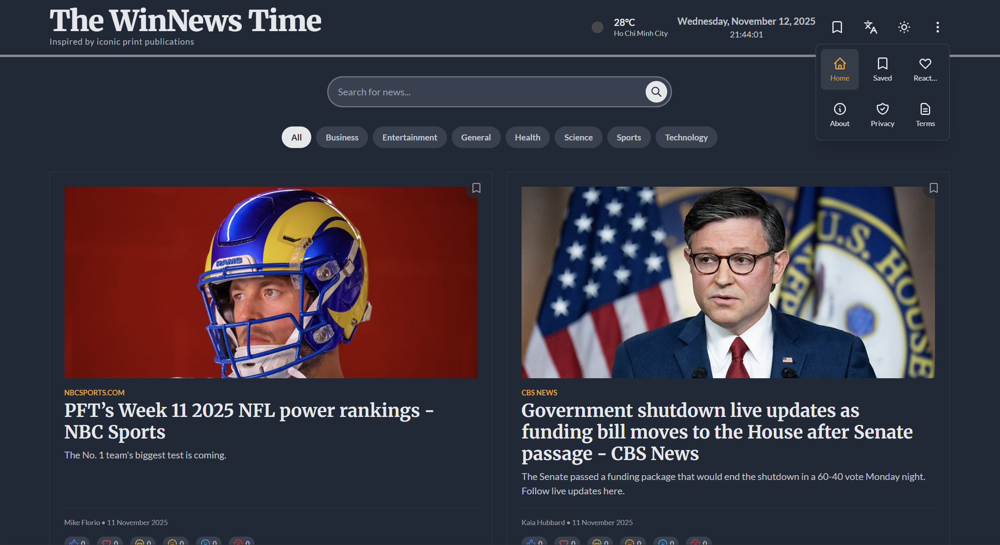

<p align="center">
    
</p>
<h1 align="center">The WinNews Time</h1>

Welcome to The WinNews Time, a modern digital newspaper experience with a nostalgic, classic aesthetic inspired by iconic print publications like The New York Times. This web application delivers the latest news headlines and allows for deep-dive searches, all wrapped in a beautifully designed, user-friendly interface.



## ✨ Features

- **Classic Newspaper Aesthetic**: Meticulously styled with serif fonts (`Merriweather`), a clean layout, and a 60/30/10 color scheme to evoke the feeling of reading a physical newspaper.
- **Offline-First Experience**: Powered by a service worker, the app caches articles and assets, allowing you to read the news even when you're offline. Loads are instant on subsequent visits.
- **Live Weather Widget**: A beautifully integrated weather widget in the header provides current weather conditions for your location using the OpenWeatherMap API.
- **Interactive Reactions**: Engage with articles by leaving an emoji reaction. See what others think at a glance.
- **Dynamic News Content**: Fetches real-time news from the **News API**, providing up-to-date top headlines and searchable articles.
- **Bilingual Support**: Seamlessly switch between **English** and **French**. The UI, dates, and news content adapt instantly.
- **Light & Dark Mode**: A stunning theme toggle that provides a comfortable reading experience in any lighting condition.
- **Skeleton Loaders**: When articles are loading, a sleek skeleton UI mimics the article layout, providing a smooth visual transition instead of a jarring loading indicator.
- **Save for Later**: Bookmark articles to read later. Your saved articles are stored locally and accessible anytime.
- **Reading History**: The app keeps track of articles you've viewed, visually dimming them so you can easily see what's new.
- **Powerful Search & Filtering**: Find articles on any topic with a sleek, integrated search bar, or browse by category.
- **Detailed Article View**: Click on any article to open a focused reading modal, complete with the full description and a link to the original source.
- **Fully Responsive**: Delivers a premium experience on all devices, from desktops to mobile phones.

## 🛠️ Tech Stack

- **Frontend**: React, TypeScript
- **Styling**: Tailwind CSS
- **PWA**: Service Workers for offline caching
- **APIs**:
  - [News API](https://newsapi.org/) for news content
  - [OpenWeatherMap API](https://openweathermap.org/api) for weather data
- **Fonts**: Google Fonts (Merriweather & Lato)
- **Icons**: Custom SVG components
- **Deploy**: Vercel

<p align="center">
    
</p>

## 🚀 Setup and Installation
Follow these instructions to get a local copy up and running for development and testing purposes.

### Prerequisites
- Node.js (v18 or later recommended)
- A package manager like `npm`, `yarn`, or `pnpm`
- A **News API** key
- An **OpenWeatherMap API** key

### Installation & Setup
1.  **Clone the repository:**
    ```sh
    git clone https://github.com/ThangHoang54/winnews-time.git
    cd winnews-time
    ```
2.  **Install dependencies:**
    ```sh
    npm install
    ```
3. Configure Services for Local Development (Mock Data)
* **Purpose:** To run the app locally using mock data instead of calling live APIs.
* **Action:**
    1.  Go to your `CODE.md` file and find the section labeled **`Local Service Code (Step 3)`**.
    2.  Copy the code for `newsService.ts` from this section and paste it into your project's `newsService.ts` file, **replacing its current contents**.
    3.  Do the same for `weatherService.ts`.

4.  **Set up Environment Variables:**
    This project requires API keys to fetch news and weather data. You can get free keys from:
    - [newsapi.org](https://newsapi.org/register)
    - [openweathermap.org/appid](https://home.openweathermap.org/users/sign_up)

    The application expects the API keys to be available as environment variables. For local development, you can create a `.env.local` file in the root of your project and add your keys:
    ```
    VITE_NEWS_API_KEY="YOUR_NEWS_API_KEY"
    VITE_OPENWEATHER_API_KEY="YOUR_OPENWEATHERMAP_API_KEY"
    ```
5.  **Run the Development Server:**
    ```sh
    npm run dev
    ```
    The application should now be running on your local development server, typically `http://localhost:8080`.

6. Configure Services for Deployment (Live APIs)
* **Purpose:** To restore the original code that calls the live APIs before you deploy your project.
* **Action:**
    1.  Go to your `CODE.md` file and find the section labeled **`Production Service Code (Step 7)`**.
        *(Note: You will need to create this section in `CODE.md` and add the original, production-ready code to it.)*
    2.  Copy the code for `newsService.ts` from this **production** section and paste it into your project's `newsService.ts` file.
    3.  Do the same for `weatherService.ts`.
   
   
## 📂 Project Structure

The codebase is organized to be clean, scalable, and easy to navigate.

```
/
├── api/                  # Server-side functions
|   └── lib/
├── public/
├── src/
|   ├── app/       
│   ├── components/       # Reusable React components 
│   │   └── icons/        # SVG Icon components
│   ├── hooks/            # Custom React hooks
│   ├── services/         # API interaction logic 
│   ├── App.tsx           # Main application component and state management
│   ├── index.tsx         # Application entry point
│   └── types.ts          # TypeScript type definitions
├── .gitignore
├── index.html
├── package.json
├── sw.js                 # Service Worker for PWA features
├── LICENSE               
└── README.md
```
## License
Distributed under the [MIT License](https://github.com/ThangHoang54/winnews-time?tab=MIT-1-ov-file). See LICENSE for more information

## 🙏 Acknowledgements

- **News API** for providing the data that powers this application.
- **OpenWeatherMap** for providing the live weather data.
- **Google Fonts** for the beautiful Merriweather and Lato typefaces.
- **Tailwind CSS** for the utility-first CSS framework.